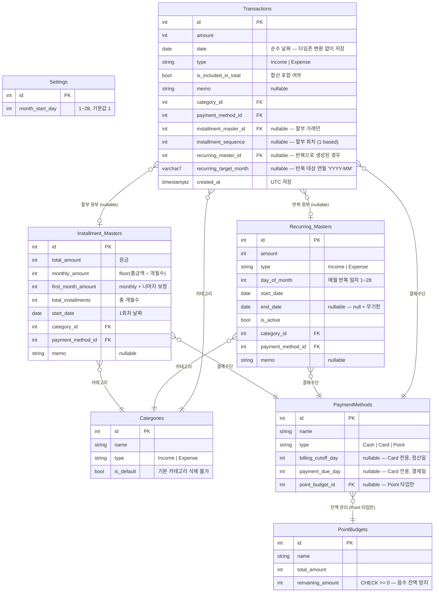

# BudgetTracker — 제품 요구사항 문서 (PRD)

> **버전**: 1.3 | **기준일**: 2026-03-16 | **범위**: MVP (Sprint 1~3+)

---

## 1. 배경 및 문제 정의

### 문제

기존 가계부 앱(뱅크샐러드, 머니포켓 등)은 다음 한계가 있습니다:

- **계정/연동 필수**: 금융사 계정 연동이 강제되거나 회원가입이 복잡함
- **과도한 기능**: 불필요한 기능·광고가 많아 빠른 거래 입력이 불편
- **커스터마이즈 부족**: 회사 복지포인트처럼 실생활에서 쓰는 비표준 결제수단 관리 불가
- **월 시작일 고정**: 급여일이 25일인 사람은 "25일~다음달 24일"을 한 달로 보고 싶지만, 대부분 앱은 1일~말일 고정

### 해결하려는 것

- 회원가입 없이 즉시 사용 가능한 경량 가계부
- 복지포인트, 식대 등 **회사 지원 예산**을 일반 결제수단과 함께 관리
- **커스텀 월 시작일** 설정으로 급여 주기에 맞는 월별 집계
- 반복 지출(월세, 할부) 자동 입력으로 누락 방지

---

## 2. 목표

### 핵심 목표 (MVP)

1. **빠른 거래 입력** — 3번 탭으로 거래 추가 완료 (금액 → 카테고리 → 결제수단)
2. **월별 현황 한눈에** — 수입·지출·잔액을 월 단위로 즉시 확인
3. **포인트 예산 관리** — 복지포인트 등 회사 지원 예산의 잔액 추적
4. **반복 거래 자동화** — 고정 지출·할부 자동 반영으로 수동 입력 부담 제거

### 성공 기준

| 지표 | 목표 |
|------|------|
| 거래 입력 소요 시간 | 10초 이내 |
| 월별 요약 화면 로드 | 1초 이내 |
| 포인트 잔액 정확도 | 거래 후 즉시 갱신 |
| 반복 거래 누락율 | 0% (자동 생성 기준) |

---

## 3. 타겟 사용자

### 주요 사용자

**직장인 개인 가계부 사용자**
- 급여일이 1일이 아닌 경우 (월 시작일 커스터마이징 필요)
- 회사 복지포인트·식대 등 별도 예산을 관리해야 하는 경우
- 카드 할부가 많아 반복 지출 추적이 필요한 경우

### 사용 패턴

- 지출 발생 직후 모바일에서 즉시 입력
- 월말/급여일 전 이번 달 현황 확인
- 가끔 통계로 지출 패턴 파악

---

## 4. 기능 명세

### 4.1 거래 관리

**기본 거래 입력**
- 금액, 날짜, 카테고리, 결제수단, 메모 입력
- 수입/지출 구분
- 합산 포함 여부 선택 (포인트 사용 거래 등 집계 제외 가능)

**거래 목록**
- 현재 월의 거래 내역을 날짜 역순으로 표시
- 카테고리별 필터 칩으로 빠른 필터링
- 메모 키워드 검색

**거래 수정/삭제**
- 기존 거래 수정
- 삭제 시 포인트 잔액 자동 복구

---

### 4.2 월 관리

**커스텀 월 시작일**
- 1~28일 중 선택 가능
- 예: 시작일=25, 3월 조회 → **2/25~3/24** 범위의 거래 집계
- 월 네비게이터(← →)로 이전/다음 월 이동

**월별 요약**
- 해당 월 총 수입 / 총 지출 / 잔액 표시
- `isIncludedInTotal=false` 거래는 집계에서 제외

**일관성 요구사항 (버그 수정 필요)**
- 거래 목록과 월별 요약은 **동일한 날짜 범위**를 기준으로 동작해야 함
- 현재 버그: 거래 목록은 `monthStartDay`를 무시하고 표준 달력 월(1일~말일)로 필터링
  - 예) `monthStartDay=25`, 3월 조회 시:
    - 요약: 2/25~3/24 기준 ✅
    - 거래 목록: 3/1~3/31 기준 ❌ → 2/25~2/28 거래가 목록에 미표시
- **수정 방향**: 거래 목록 API도 `monthStartDay`를 로드하여 `DateRangeHelper.GetMonthRange()`로 변환한 `from/to` 범위로 필터링

---

### 4.3 카테고리 관리

- 수입/지출 카테고리 구분
- 사용자 직접 추가/삭제 가능
- 기본 카테고리(시드 데이터) 삭제 불가
- 연결된 거래가 있는 카테고리 삭제 불가

**기본 지출 카테고리**: 식비, 교통, 주거, 통신, 의료, 문화/여가, 교육, 쇼핑, 기타지출
**기본 수입 카테고리**: 급여, 부수입, 기타수입

---

### 4.4 결제수단 관리

- 현금(Cash) / 카드(Card) / 포인트(Point) 타입 구분
- 사용자 직접 추가 (예: 신한카드, 국민카드 별도 등록)
- 기본 항목(현금, 카드) 삭제 불가

**카드 청구 설정 (Card 타입 전용)**
- 카드별 **정산일**(billing cutoff date)과 **결제일**(payment due date) 설정 가능
  - 정산일: 카드 이용 내역이 마감되는 날 (예: 매월 15일)
  - 결제일: 실제 대금이 출금되는 날 (예: 매월 25일)
- 예) 정산일=15, 결제일=25 → 전월 16일~당월 15일 이용금액이 당월 25일에 결제

---

### 4.5 포인트/복지 예산

**예산 등록**
- 예산명 + 총액 입력 (예: "복지포인트" 2,000,000원)
- 초기 잔액 = 총액으로 자동 설정

**잔액 관리**
- 포인트 결제수단으로 거래 생성 시 잔액 자동 차감
- 거래 삭제 시 잔액 자동 복구
- 잔액 부족 시 거래 생성 불가 (잔액 검증)
- 거래 수정 시 이전 포인트 복구 후 새 포인트 차감

**표시**
- 결제수단 선택 드롭다운에 현재 잔액 표시
- 설정 화면에서 전체 예산 목록 + 잔액/총액 확인

---

### 4.6 거래 유형 — 상세 동작 로직

모든 거래는 **단건(Single) / 할부(Installment) / 반복(Recurring)** 중 하나의 유형을 가진다.

#### 테이블 구조 개요

```
Transactions (거래 내역)          — 가계부 화면에 표시되는 개별 레코드
Installment_Masters (할부 원부)   — 할부 설정값 저장, Transactions와 1:N
Recurring_Masters (반복 원부)     — 반복 설정값 저장, Transactions와 1:N
```

- `Transactions.installment_master_id` → `Installment_Masters.id` (nullable)
- `Transactions.recurring_master_id`   → `Recurring_Masters.id` (nullable)
- 두 FK가 모두 null이면 단건 거래

---

#### 단건 (Single)

- 1회성 거래. FK 없음.
- 수정/삭제: 해당 레코드만 영향.

---

#### 할부 (Installment)

**저장 (Create)**

1. `Installment_Masters`에 원부 1건 저장
2. Transactions에 N개(= 개월수) 회차 레코드 **즉시 일괄 생성**
   - 날짜: 시작일 기준 매월 동일 일자 (월말 초과 시 말일로 클램프)
   - 금액: `floor(총금액 ÷ 개월수)`, 1회차에 나머지(총금액 - floor × N) 합산
   - 예) 100,000원 / 3개월 → 1회차: 33,334원, 2~3회차: 33,333원

**할부 원부 저장 항목**

| 항목 | 설명 |
|------|------|
| `total_amount` | 원금 |
| `monthly_amount` | `floor(총금액 ÷ 개월수)` |
| `total_installments` | 총 개월수 |
| `start_date` | 첫 번째 할부 날짜 |
| `category_id` / `payment_method_id` / `memo` | 거래 공통 속성 |

**수정 (Update) — 원부 수정**

- `Installment_Masters` 수정 시 연결된 **모든 Transactions 일괄 업데이트**
- 업데이트 대상: 금액·카테고리·결제수단·메모
- 날짜는 각 회차의 원래 날짜 유지 (회차 순서는 변경하지 않음)

**삭제 (Delete)**

- `Installment_Masters` 삭제 시 연결된 **모든 Transactions 함께 삭제** (CASCADE)

**할부 거래 상세 팝업**

- 거래 목록에서 할부 거래 클릭 시 상세 팝업 표시
- 표시 항목: 총금액(원금) / 이번 달 할부금 / 남은 금액(잔여 개월 × 월 할부금) / 진행 현황(예: 3/12회차)

---

#### 반복 (Recurring)

**저장 (Create)**

- `Recurring_Masters`에 설정값 저장 (금액·반복일·카테고리·결제수단·메모·시작일·종료일)
- **저장 시점에 Transactions를 즉시 생성하지 않음**

**반복 원부 저장 항목**

| 항목 | 설명 |
|------|------|
| `amount` | 반복 금액 |
| `day_of_month` | 매월 반복 일자 (1~28) |
| `start_date` | 최초 반복 시작 날짜 |
| `end_date` | 반복 종료 날짜 (null = 무기한) |
| `category_id` / `payment_method_id` / `memo` | 거래 공통 속성 |

**생성 (On-demand Generation)**

- 거래 목록/요약 조회 시 해당 월의 반복 거래 미생성 여부를 확인하여 자동 삽입
- 중복 방지: `(recurring_master_id, 연월)` 조합으로 이미 생성된 레코드 존재 시 SKIP
- 생성된 Transactions 레코드는 `recurring_master_id`로 원부와 연결

**개별성 (독립 동작)**

- 반복으로 생성된 Transactions는 생성 이후 **독립적인 단건처럼 동작**
- 특정 달 거래의 금액·메모를 수정해도 `Recurring_Masters`(원부)에 영향 없음
- 원부 수정은 **이후 미생성 회차**에만 적용됨 (이미 생성된 레코드 불변)

**삭제 (Delete)**

- 단건 삭제: 해당 월 거래 1건만 삭제 (`Recurring_Masters` 유지)
- 원부 삭제: `Recurring_Masters` 삭제 → 이후 미생성 회차 차단, 기존 생성 레코드는 유지

**반복 관리 화면 (별도 화면 요구사항)**

- 설정 화면 내 "반복 거래 관리" 섹션으로 접근
- 표시 항목: 반복명(카테고리) / 반복일 / 금액 / 시작일 / 상태(진행중/종료)
- 기능: 원부 수정(이후 회차에 반영) / 원부 삭제(이후 회차 중단)

---

#### 수정/삭제 UX 가이드 — 유형별 분기

거래 목록에서 할부·반복 거래의 상세 팝업을 열면 아래 분기를 명확히 안내한다.

| 유형 | 수정 버튼 동작 | 삭제 버튼 동작 |
|------|--------------|--------------|
| 단건 | 단건 수정 모달 | 단건 삭제 확인 |
| 할부 | "할부 원부 수정 (전체 회차 변경)" 안내 후 원부 수정 모달 | "전체 할부 삭제" 확인 다이얼로그 |
| 반복 | 선택 다이얼로그: **이번 달만 수정** / **원부 수정(이후 회차 반영)** | 선택 다이얼로그: **이번 달만 삭제** / **반복 중단(이후 회차 차단)** |

- 반복 "이번 달만 수정": 해당 Transactions 단건만 변경, 원부 불변
- 반복 "원부 수정": `Recurring_Masters` 업데이트, 이미 생성된 레코드는 불변

---

### 4.7 카드 결제 현황 — 메인 화면 통합 위젯 (v1.4 변경)

> **변경 이력**: v1.3까지는 별도 하단 탭으로 설계되었으나, v1.4에서 **메인 가계부 화면 내 '예정된 지출(Upcoming)' 위젯으로 통합**하도록 전면 변경.

**목적**: 다음 결제일에 각 카드별로 얼마를 납부해야 하는지, 그리고 미등록 반복 지출이 얼마나 남았는지를 메인 화면에서 한눈에 파악

---

#### UI 흐름

**① 위젯 헤더 (항상 표시)**

메인 거래 목록 상단, 검색바 아래에 항상 표시되는 아코디언 헤더.

```
[ 📅 예정된 지출  4건  -456,900원 (+3,000,000)  ▼ ]
```

- 반복 예정 건수 + 카드 장수 합산 표시
- 총 예정 지출 / 수입 간략 표시
- 탭하면 ②로 펼쳐짐

**② 펼쳐진 위젯 (아코디언 확장)**

두 섹션으로 구성:

```
[ 반복 예정 2건 ]
  ● 월세  매월 20일  -500,000원  [×]
  ● 넷플릭스  매월 18일  -13,900원  [×]

[ 카드 결제 예정  · 탭하면 청구 내역만 필터링 ]
  💳 신한카드   D-9   결제일 25일 · 2/16~3/15   287,000원  [›]
  💳 국민카드   D-9   결제일 25일 · 2/16~3/15   142,000원  [›]
```

- **반복 예정 섹션**: 현재 월 미등록 반복 항목. 각 항목의 [×]로 삭제 옵션 바텀 시트 호출
- **카드 결제 예정 섹션**: 정산일/결제일이 설정된 카드별 이번 청구 요약
  - D-day 배지: D-day(빨강) / D-7 이내(주황) / 이외(회색)
  - 카드 항목 탭 → ③ 드릴다운 필터링 실행

**③ 카드 드릴다운 (거래 목록 필터링)**

카드 항목을 탭하면 위젯이 닫히고 메인 거래 목록이 **해당 카드의 청구 기간 내역으로만 필터링**됨.

- 검색바 아래에 필터 칩 표시:
  ```
  필터  [ 💳 신한카드 청구 내역  × ]  2/16~3/15
  ```
- [×] 탭 → 필터 해제, 원래 월별 거래 목록 복원
- 필터 활성 시: 해당 카드 + 해당 기간(periodFrom ~ periodTo) 거래만 표시
- 카테고리 필터 칩은 카드 필터와 중첩되지 않음 (카드 필터 우선)

---

#### 카드 청구 설정 (4.4와 연계)

- 설정 화면에서 카드별 **정산일**(billing cutoff date)과 **결제일**(payment due date) 직접 설정
- 정산일=N: 전월 (N+1)일 ~ 당월 N일이 청구 기간, 당월 결제일에 납부
- 정산일/결제일 미설정 카드는 위젯에서 제외

**청구 기간 계산 기준 (정산일=15, 결제일=25 예시)**

| 오늘 | 이번 청구 기간 | 결제일 | D-day |
|------|--------------|--------|-------|
| 3/16 | 2/16 ~ 3/15 | 3/25 | D-9 |
| 3/25 | 2/16 ~ 3/15 | 3/25 | D-day |
| 3/26 | 3/16 ~ 4/15 | 4/25 | D-30 |

> 케이스 B (결제일 < 정산일, 다음 달 결제) 등 상세 케이스는 Step 3 구현 시 백엔드 서비스에서 처리.

---

### 4.9 통계

- 카테고리별 지출 비율 (원형 그래프)
- 전월 대비 수입/지출 변화율
- 최근 6개월 수입/지출 추이 (라인 차트)

---

### 4.10 검색 및 필터

- 메모 키워드 검색 (대소문자 무시, PostgreSQL ILike)
- 카테고리 필터 칩 (현재 월 데이터 기준)
- 날짜, 금액 범위 필터 (API 지원, UI 우선순위 낮음)

---

## 5. 비기능 요구사항

| 항목 | 요구사항 |
|------|---------|
| 응답성 | 거래 목록 로드 1초 이내 |
| UI | 모바일 우선 (Mobile First), 최대 너비 512px |
| 반응형 | 모바일 / 태블릿 / PC 모두 대응 |
| 데이터 무결성 | 포인트 차감/복구 원자성 보장 (단일 SaveChanges) |
| 데이터 무결성 | 반복 거래 중복 생성 방지: DB UNIQUE 제약으로 Race Condition 원천 차단 |
| 데이터 무결성 | 포인트 잔액 음수 방지: DB CHECK 제약으로 Fail-fast 처리 |
| 타임존 | `created_at` 등 시각 컬럼은 `timestamptz` 사용 (UTC 저장, 표시 시 KST 변환) |
| 타임존 | 거래일(`date`) 컬럼은 순수 날짜(`date` 타입)로 저장 — 클라이언트가 로컬 날짜(`YYYY-MM-DD`)를 그대로 전송하며 서버는 타임존 변환 없이 저장. 집계·필터 계산도 date 단위로만 처리하여 UTC/KST 오프셋 버그 원천 차단 |
| 보안 | MVP: 인증 없음 (단일 사용자 가정) |
| 배포 | Render 자동 배포 (main 브랜치 push 시) |

---

## 6. 스코프 외 (향후 개발)

다음 기능은 MVP 범위에 포함하지 않습니다:

- 사용자 인증 / 멀티 유저
- 예산 한도 설정 및 초과 알림
- 금융사 자동 연동
- 영수증 이미지 첨부
- CSV/Excel 내보내기
- 오프라인 모드

---

## 7. 연관 문서

| 문서 | 내용 |
|------|------|
| `ROADMAP.md` | 스프린트 계획, DB 스키마, API 엔드포인트 목록 |
| `docs/backend-architecture.md` | 3계층 아키텍처 설계 |
| `docs/frontend-data-rule.md` | 프론트엔드 데이터 처리 규칙 |
| `docs/coding-style.md` | 코딩 컨벤션 |

---

## 8. DB 스키마 (ERD)

> Mermaid erDiagram — PRD v1.2 기준 전체 엔티티 관계도



### 거래 유형 판별 규칙

| `installment_master_id` | `recurring_master_id` | 거래 유형 |
|------------------------|-----------------------|---------|
| NULL | NULL | 단건 (Single) |
| NOT NULL | NULL | 할부 (Installment) |
| NULL | NOT NULL | 반복으로 생성된 단건 (Recurring-generated) |

### 주요 제약 조건

| 테이블 | 제약 |
|--------|------|
| `Categories` | `is_default=true`이거나 연결된 Transactions 존재 시 삭제 불가 |
| `PaymentMethods` | Point 타입은 반드시 `point_budget_id` 보유 |
| `PaymentMethods` | Card 타입만 `billing_cutoff_day` / `payment_due_day` 설정 가능 |
| `Recurring_Masters` | `day_of_month` 범위: 1~28 (2월 말일 이슈 방지) |
| `Installment_Masters` | 삭제 시 연결된 모든 Transactions CASCADE 삭제 |
| `Recurring_Masters` | 삭제 시 기존 생성 Transactions 유지, 이후 미생성 회차만 차단 |
| `Transactions` | `installment_master_id`와 `recurring_master_id` 동시 NOT NULL 불가 |
| `Transactions` | **UNIQUE (`recurring_master_id`, `recurring_target_month`)** — Race Condition 중복 생성 원천 차단 (v1.3) |
| `PointBudgets` | **CHECK (`remaining_amount >= 0`)** — 동시 결제 시 음수 잔액 Fail-fast 차단 (v1.3) |
| `Transactions` | `created_at` → `timestamptz` (UTC 저장) / `date` → `date` 타입 (순수 날짜, 타임존 변환 없음) (v1.3) |

### 데이터 정합성 제약 조건 상세 (v1.3)

#### 1. 반복 거래 중복 생성 방지 (Idempotency)

On-demand 방식에서 월 조회 API가 동시에 호출될 경우 `ApplyRecurringTransactionsAsync`가 중복 실행될 수 있다. 애플리케이션 레벨의 중복 체크만으로는 Race Condition을 완전히 막을 수 없으므로, DB 레벨에서 최후 방어선을 제공한다.

```
Transactions 에 recurring_target_month varchar(7) 컬럼 추가
  → 반복 거래 생성 시 'YYYY-MM' 형식으로 대상 연월 기록

UNIQUE INDEX uix_recurring_target_month
  ON Transactions (RecurringTransactionId, RecurringTargetMonth)
  WHERE RecurringTransactionId IS NOT NULL
    AND RecurringTargetMonth IS NOT NULL
  → 동일 원부 + 동일 연월 조합으로 두 번째 INSERT 시 즉시 unique_violation 발생
```

**백엔드 처리 원칙**: unique_violation(PostgreSQL 오류 코드 23505) 발생 시 이미 생성된 것으로 간주하고 조용히 무시(SKIP). 오류를 상위로 전파하지 않는다.

---

#### 2. 포인트 잔액 음수 방지 (Fail-fast)

애플리케이션 레벨 검증(잔액 충분 여부 확인 후 차감)이 1차 방어지만, 동시 결제나 버그로 잔액이 음수로 떨어지는 것을 DB가 최종 차단한다.

```
PointBudgets 에 CHECK (RemainingAmount >= 0) 추가
  → 잔액 부족 상태로 UPDATE 시 check_violation (23514) 즉시 발생
  → 잔액 복구(RECOVER) → 잔액 검증 → 잔액 차감(DEDUCT) 순서 강제
```

---

#### 3. 날짜/타임존 명확화

| 컬럼 | 타입 | 원칙 |
|------|------|------|
| `created_at` | `timestamptz` | DB에 UTC로 저장, 표시 시 KST(+09:00) 변환 |
| `date` (거래일) | `date` | 클라이언트가 `YYYY-MM-DD` 로컬 날짜를 그대로 전송. 서버는 타임존 변환 없이 저장 및 필터링 |
| `start_date`, `end_date` | `date` | 동일 원칙 |

**KST 자정 근처 버그 시나리오**: 23:50 KST에 입력한 거래를 `timestamptz`로 저장하면 UTC 기준 14:50이 되어 날짜가 달라질 수 있다. `date` 타입 사용으로 이 문제를 근본 차단한다.
